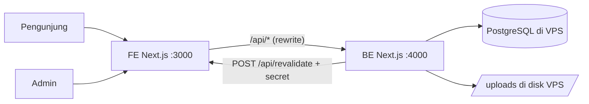

# PRD: Website Training Provider + Admin CMS

| | |
|---|---|
| Versi | 0.1 (draft) |
| Tanggal | 8 Oktober 2026 |
| Pemilik | Ade |
| Status | Draft, menunggu review atasan |
| Referensi | https://diotraining.com (struktur & alur konten, bukan desain) |

---

## 1. Ringkasan

Membangun ulang website training provider dengan pendekatan **ATM (Amati, Tiru, Modifikasi)** dari diotraining.com. Struktur informasi (beranda, profil, layanan, katalog pelatihan, jadwal, evaluasi, kontak) diadaptasi, tetapi **desain dibuat baru**: minimalis, monokrom (putih, hitam, abu), dan interaktif.

Pembeda utama dari referensi: **seluruh konten website bisa diatur dari panel admin** (CRUD teks, gambar, menu, section beranda, katalog pelatihan, jadwal, klien, kontak marketing, SEO), tanpa perlu menyentuh kode.

## 2. Tujuan & Metrik

| Tujuan | Indikator keberhasilan |
|---|---|
| Admin non-teknis bisa mengubah semua konten | 100% teks & gambar di halaman publik berasal dari database, 0 konten hardcode selain label UI |
| Pengunjung cepat menemukan pelatihan | Pencarian & filter kategori menghasilkan hasil < 300 ms (p95, data 1.000+ judul) |
| Website cepat & SEO-friendly | Lighthouse Performance ≥ 90, SEO ≥ 95 (mobile) di halaman beranda & detail pelatihan |
| Konversi ke kontak | Setiap halaman pelatihan punya CTA WhatsApp + form inquiry yang tersimpan ke database |

## 3. Peran Pengguna

| Peran | Akses |
|---|---|
| **Pengunjung** | Melihat semua halaman publik, mencari pelatihan, kirim inquiry, isi form evaluasi |
| **Editor** | CRUD konten (pelatihan, jadwal, halaman, section, media, klien), tidak bisa kelola user & pengaturan sistem |
| **Super Admin** | Semua akses Editor + kelola user, role, pengaturan situs, redirect, audit log |

## 4. Ruang Lingkup

### 4.1 Masuk MVP
- Website publik (semua halaman di bagian 5)
- Panel admin CMS (bagian 6)
- Autentikasi admin (email + password)
- Media library (upload, crop dasar, kompres otomatis)
- Database PostgreSQL di VPS
- SEO dasar: meta per halaman, sitemap.xml, robots.txt, Open Graph, redirect lama ke baru

### 4.2 Di luar MVP (fase berikutnya)
- Dockerisasi & CI/CD (folder `docker/` disiapkan, diisi nanti)
- Pembayaran online / checkout pelatihan
- Akun peserta / LMS
- Multi-bahasa (EN)
- Blog/artikel terpisah dari katalog pelatihan

## 5. Website Publik

### 5.1 Sitemap

```
/                              Beranda
/profil                        Tentang kami (visi, misi, keunggulan, company profile)
/profil/portofolio             Portofolio / dokumentasi kegiatan
/layanan                       Daftar layanan
/layanan/[slug]                Detail layanan (In House, Public, Sertifikasi BNSP, Outbound, dst.)
/pelatihan                     Katalog pelatihan (search + filter kategori)
/pelatihan/kategori/[slug]     Pelatihan per kategori
/pelatihan/[slug]              Detail pelatihan
/jadwal                        Jadwal training (list/kalender)
/evaluasi                      Form evaluasi peserta
/kontak                        Kontak, peta, form inquiry
/[slug]                        Halaman statis (Syarat & Ketentuan, Kebijakan Privasi, dll.)
```

> Catatan SEO: kalau website ini menggantikan domain lama, semua URL lama (contoh `/category/accounting/`, `/main-training/`) wajib di-redirect 301 lewat tabel `Redirect` yang dikelola admin.

### 5.2 Komponen global
- **Header**: logo, menu (diatur admin, mendukung dropdown), tombol search (membuka command palette), tombol CTA.
- **Command palette search** (`Ctrl/Cmd + K`): cari pelatihan, kategori, layanan secara instan.
- **Menu kategori**: karena kategori banyak (70+), tidak pakai dropdown panjang. Pakai overlay layar penuh berisi indeks kategori A-Z dengan filter ketik.
- **Floating contact**: tombol WhatsApp melayang, saat diklik membuka panel daftar marketing (foto, nama, nomor) yang diatur admin.
- **Footer**: deskripsi singkat, sosial media, media partner, link bantuan, alamat, peta embed, copyright. Semua dari admin.

### 5.3 Beranda (section diatur & diurutkan admin)

| # | Section | Isi |
|---|---|---|
| 1 | Hero | Headline besar, subjudul, input search pelatihan, 1-2 tombol CTA, gambar/visual opsional |
| 2 | Statistik | Angka berjalan (contoh: 100+ trainer, 1.000+ judul, 4 negara) |
| 3 | Layanan unggulan | 4 layanan dalam bentuk baris bernomor, hover menampilkan gambar |
| 4 | Kategori | Chip kategori populer, link ke katalog terfilter |
| 5 | Pelatihan terbaru | Grid/scroll horizontal kartu pelatihan (otomatis dari data atau dipilih manual) |
| 6 | Jadwal terdekat | 5 sesi terdekat dari tabel jadwal |
| 7 | Klien | Marquee logo klien (grayscale, hover jadi hitam penuh) |
| 8 | Visi & Misi | Ringkas, 2 kolom |
| 9 | Testimoni | Opsional, carousel |
| 10 | CTA penutup | Blok hitam penuh dengan ajakan konsultasi |

Setiap section bisa: diaktif/nonaktifkan, diurutkan ulang (drag & drop), diedit isinya.

### 5.4 Profil
Konten rich text + blok terstruktur: tentang, layanan, visi, misi, moto, keunggulan (list kartu), bidang pelatihan unggulan, target peserta, tombol unduh company profile (file PDF di media library).

### 5.5 Katalog pelatihan
- Search full-text (judul, ringkasan, kategori).
- Filter: kategori (multi), metode (online/offline/hybrid), tipe (public/in-house).
- Sort: terbaru, A-Z.
- Pagination atau infinite scroll (default 24 per halaman).
- URL menyimpan state filter (`?q=&kategori=&metode=`) agar bisa dibagikan.

### 5.6 Detail pelatihan
Field (asumsi, konfirmasi ke atasan): judul, kategori, gambar cover, ringkasan, deskripsi (rich text), tujuan, materi/silabus, target peserta, durasi, metode, investasi/harga (opsional, bisa disembunyikan), fasilitas, jadwal terkait (dari tabel jadwal), CTA WhatsApp dengan pesan otomatis berisi judul pelatihan, form inquiry, pelatihan terkait (kategori sama).

### 5.7 Jadwal training
Tabel/list sesi: judul pelatihan, tanggal mulai-selesai, kota/lokasi, metode, harga, status (dibuka/penuh/selesai). Filter bulan, kota, kategori. Toggle tampilan list dan kalender bulanan.

### 5.8 Evaluasi
Form evaluasi peserta pasca pelatihan (asumsi, konfirmasi fungsi aslinya): pilih sesi pelatihan, nama, instansi, email, rating per aspek (materi, trainer, fasilitas, dll.), saran. Pertanyaan diatur admin. Hasil tersimpan & bisa diekspor CSV.

### 5.9 Kontak
Alamat, telepon, email, peta embed, daftar marketing, form inquiry (nama, instansi, email, WA, pelatihan diminati, pesan). Proteksi spam: honeypot + rate limit.

## 6. Panel Admin (`/admin`)

### 6.1 Modul

| Modul | Fungsi |
|---|---|
| Dashboard | Ringkasan: jumlah pelatihan, jadwal bulan ini, inquiry baru, evaluasi baru, aktivitas terakhir |
| Pengaturan situs | Nama situs, tagline, logo (terang/gelap), favicon, kontak, alamat, embed peta, sosial media, teks footer, default SEO |
| Navigasi | CRUD menu header & footer, nested 1 level, drag & drop urutan |
| Beranda | CRUD section beranda: tambah, edit isi, urutkan, aktif/nonaktif, preview |
| Halaman | CRUD halaman statis & halaman profil (rich text + blok) |
| Layanan | CRUD layanan (ikon, judul, ringkasan, detail, gambar, urutan) |
| Kategori | CRUD kategori pelatihan (nama, slug, deskripsi, ikon, urutan, unggulan) |
| Pelatihan | CRUD pelatihan, rich text editor, status draft/publish, jadwal publish, duplikasi, bulk action (publish, pindah kategori, hapus) |
| Jadwal | CRUD sesi jadwal per pelatihan, import CSV |
| Klien | CRUD logo klien (gambar, nama, link, urutan) |
| Testimoni | CRUD testimoni |
| Portofolio | CRUD item portofolio (judul, gambar galeri, tanggal, klien) |
| Kontak marketing | CRUD marketing (foto, nama, nomor WA, pesan default, urutan, aktif) |
| Media partner | CRUD link media partner |
| Media library | Upload gambar/PDF, folder, alt text, cari, lihat file dipakai di mana, hapus aman |
| Inquiry | Daftar pesan masuk, status (baru/diproses/selesai), catatan, ekspor CSV |
| Evaluasi | Kelola pertanyaan, lihat & ekspor jawaban |
| SEO & Redirect | Meta per halaman, CRUD redirect 301/302 |
| User & Role | Super Admin: CRUD user, reset password, set role |
| Audit log | Siapa mengubah apa & kapan |

### 6.2 Aturan umum CRUD
- Setiap entitas konten punya `status` (draft/published) bila relevan, `createdAt`, `updatedAt`, `updatedBy`.
- Hapus = soft delete (`deletedAt`), bisa dipulihkan dari "Sampah" 30 hari.
- Slug otomatis dari judul, bisa diedit, unik, validasi bentrok.
- Validasi form realtime, pesan error dalam Bahasa Indonesia.
- Setiap simpan konten publik memicu revalidasi halaman terkait (perubahan tampil < 5 detik tanpa redeploy).
- Tombol **Preview** sebelum publish.
- Unsaved-changes guard saat meninggalkan form.

### 6.3 Media
- Format: JPG, PNG, WebP, SVG (disanitasi), PDF. Maks 10 MB.
- Gambar otomatis dikonversi ke WebP + dibuat varian ukuran (thumb 320, md 768, lg 1600).
- Alt text wajib untuk gambar yang tampil di publik.
- File disimpan di disk VPS (`/var/app/uploads`, path dari env), dilayani BE.

## 7. Arsitektur Teknis

### 7.1 Tech stack

| Lapisan | Pilihan |
|---|---|
| FE (publik + admin UI) | Next.js (App Router) + React + TypeScript |
| BE (API) | Next.js (Route Handlers, API only) + TypeScript |
| Database | PostgreSQL 16 di VPS (Sumopod) |
| ORM | Prisma |
| Validasi | Zod |
| Styling | Tailwind CSS |
| Komponen admin | shadcn/ui (tema neutral) |
| Animasi | Motion (framer-motion) |
| Rich text | Tiptap |
| Data fetching admin | TanStack Query |
| Tabel admin | TanStack Table |
| Form | React Hook Form + Zod |
| Drag & drop | dnd-kit |
| Image processing | sharp |
| Testing | **Vitest** (berbasis Vite) + Testing Library, Playwright untuk e2e |

> **Catatan soal Vite**: Next.js punya bundler sendiri (Turbopack/Webpack), jadi Vite tidak dipakai untuk build aplikasi. Vite masuk lewat **Vitest** sebagai test runner. Kalau atasan mewajibkan Vite sebagai bundler, opsinya admin dipisah jadi SPA React + Vite, tapi itu menambah 1 aplikasi lagi. Perlu dikonfirmasi.

### 7.2 Struktur repo

```
/
├── BE/                 Next.js API-only (port 4000)
│   ├── prisma/         schema.prisma, migrations, seed.ts
│   └── src/
│       ├── app/api/    route handlers (public/*, admin/*, auth/*)
│       ├── lib/        db, auth, validators (zod), storage, revalidate
│       └── services/   logika bisnis per modul
├── FE/                 Next.js publik + admin UI (port 3000)
│   └── src/
│       ├── app/(public)/   halaman publik
│       ├── app/admin/      panel admin
│       ├── components/     ui/, public/, admin/
│       └── lib/            api client, types, utils
├── env/                file env (contoh di-commit, asli di-gitignore)
│   ├── be.env.example
│   └── fe.env.example
├── docker/             (nanti) Dockerfile, compose
├── AGENTS.md
├── CLAUDE.md
├── DESIGN.md
└── PRD.md
```

### 7.3 Alur data



- FE me-rewrite `/api/*` dan `/uploads/*` ke BE, sehingga browser hanya bicara ke satu origin (cookie sesi aman, tanpa CORS).
- Halaman publik di-render di server (SSG/ISR) dengan `fetch` bertag. Setelah admin menyimpan, BE memanggil endpoint revalidate FE dengan tag terkait.

### 7.4 Database di VPS
- PostgreSQL 16 berjalan di VPS, **bind ke 127.0.0.1**, port tidak dibuka ke publik.
- Dev lokal mengakses lewat SSH tunnel: `ssh -L 5433:127.0.0.1:5432 user@vps`, lalu `DATABASE_URL` mengarah ke `localhost:5433`.
- Database terpisah: `training_dev` dan `training_prod`, user DB terpisah dengan hak minimum.
- Backup harian `pg_dump` (retensi 14 hari) via cron di VPS.

### 7.5 Model data (ringkas)

| Tabel | Field utama |
|---|---|
| User | id, name, email, passwordHash, role (SUPER_ADMIN/EDITOR), active, lastLoginAt |
| Session | id, userId, expiresAt, ip, userAgent |
| SiteSetting | key (unik), value (JSON) |
| NavItem | id, location (HEADER/FOOTER), label, href, parentId, order |
| HomeSection | id, type (HERO/STATS/SERVICES/...), title, content (JSON tervalidasi per type), order, visible |
| Page | id, slug, title, blocks (JSON), status, seo (JSON) |
| Service | id, slug, title, icon, summary, body, imageId, order, status, seo |
| Category | id, slug, name, description, icon, order, featured |
| Training | id, slug, title, summary, body, objectives, syllabus, audience, duration, method, priceText, showPrice, coverId, status, publishedAt, seo |
| TrainingCategory | trainingId, categoryId |
| Schedule | id, trainingId, startDate, endDate, city, venue, method, price, status |
| Client | id, name, logoId, url, order |
| Testimonial | id, name, role, company, quote, photoId, order |
| PortfolioItem | id, title, date, client, description, images (relasi Media) |
| MarketingContact | id, name, photoId, phone, defaultMessage, order, active |
| MediaPartner | id, name, url, order |
| Media | id, path, mime, size, width, height, alt, folder, variants (JSON) |
| Inquiry | id, name, company, email, phone, trainingId, message, status, note |
| EvaluationQuestion | id, label, type (RATING/TEXT), order, active |
| EvaluationResponse | id, scheduleId, name, company, email, answers (JSON), createdAt |
| Redirect | id, from, to, code (301/302) |
| AuditLog | id, userId, action, entity, entityId, diff (JSON), createdAt |

Semua tabel konten punya `createdAt`, `updatedAt`, `deletedAt` (soft delete).

### 7.6 API (BE)

| Grup | Endpoint |
|---|---|
| Auth | `POST /api/auth/login`, `POST /api/auth/logout`, `GET /api/auth/me` |
| Publik (GET) | `/api/public/settings`, `/nav`, `/home`, `/pages/:slug`, `/services`, `/services/:slug`, `/categories`, `/trainings?q&category&method&page`, `/trainings/:slug`, `/schedules?month&city`, `/clients`, `/testimonials`, `/portfolio`, `/marketing`, `/search?q` |
| Publik (POST) | `/api/public/inquiries`, `/api/public/evaluations` |
| Admin | `/api/admin/{resource}` dengan GET list (paginasi, search, sort), POST, `GET/PATCH/DELETE /:id`, `POST /:id/restore`, `POST /reorder` |
| Media | `POST /api/admin/media` (multipart), `GET /api/admin/media`, `PATCH/DELETE /api/admin/media/:id` |
| Ekspor | `GET /api/admin/inquiries/export.csv`, `GET /api/admin/evaluations/export.csv` |

Format respons: `{ data, meta? }` untuk sukses, `{ error: { code, message, fields? } }` untuk gagal.

### 7.7 Keamanan
- Password di-hash dengan argon2id. Login di-rate-limit (5x gagal / 15 menit per IP+email).
- Sesi di database, cookie `httpOnly`, `Secure`, `SameSite=Lax`. Endpoint mutasi cek header `Origin`.
- Semua input divalidasi Zod di BE. Rich text disanitasi sebelum disimpan & dirender.
- Upload: cek MIME dari isi file (bukan ekstensi), SVG disanitasi, nama file diacak.
- Role dicek di setiap endpoint admin (bukan hanya di UI).

## 8. Kebutuhan Non-Fungsional
- Responsif: 360 px sampai 1920 px.
- Aksesibilitas: WCAG 2.1 AA, navigasi keyboard penuh, `prefers-reduced-motion` dihormati.
- Performa: LCP < 2,5 s, CLS < 0,1 di koneksi 4G.
- SEO: metadata dinamis, JSON-LD (Organization, Course, Event untuk jadwal), sitemap otomatis.
- Bahasa UI: Bahasa Indonesia.

## 9. Tahapan Pengerjaan

| Fase | Isi | Output |
|---|---|---|
| 0. Setup | Repo, BE & FE skeleton, env, koneksi DB VPS, Prisma schema awal | Bisa `dev` kedua app, migrasi jalan |
| 1. Fondasi | Auth admin, layout admin, design tokens, komponen dasar, media upload | Login & upload gambar jalan |
| 2. Konten inti | Settings, navigasi, kategori, pelatihan, jadwal + halaman publik terkait | Katalog & detail pelatihan live |
| 3. Beranda & halaman | Home sections builder, profil, layanan, klien, testimoni, portofolio, marketing | Beranda full dari CMS |
| 4. Interaksi | Inquiry, evaluasi, command palette search, animasi, floating contact | Semua form & interaksi jalan |
| 5. Polish | SEO, redirect, audit log, sampah/restore, aksesibilitas, test e2e | Siap UAT |
| 6. Deploy | Docker & deploy ke VPS | (fase berikutnya) |

## 10. Kriteria Penerimaan (ringkas)
- [ ] Semua teks & gambar halaman publik bisa diubah dari admin dan tampil < 5 detik tanpa redeploy.
- [ ] Section beranda bisa ditambah, dihapus, diurutkan, disembunyikan.
- [ ] CRUD pelatihan lengkap termasuk draft/publish, kategori multi, jadwal terkait.
- [ ] Search menemukan pelatihan dari kata di judul/ringkasan, termasuk via `Ctrl/Cmd + K`.
- [ ] Editor tidak bisa mengakses modul User & Role (dicek di API).
- [ ] Inquiry & evaluasi tersimpan dan bisa diekspor CSV.
- [ ] Lighthouse mobile beranda: Performance ≥ 90, Accessibility ≥ 95, SEO ≥ 95.
- [ ] Desain mengikuti DESIGN.md (monokrom, minimalis, interaktif).

## 11. Pertanyaan Terbuka
1. Vite wajib sebagai bundler, atau cukup lewat Vitest? (lihat 7.1)
2. Nama brand, logo, dan domain website baru? Apakah menggantikan diotraining.com atau brand lain?
3. Konten awal: migrasi dari website lama (1.000+ pelatihan) atau input manual? Kalau migrasi, perlu skrip import.
4. Fungsi halaman "Evaluasi" di website lama persisnya apa?
5. Harga pelatihan ditampilkan publik atau "hubungi marketing"?
6. Spesifikasi VPS (RAM/CPU/disk) cukup untuk Postgres + 2 app Next.js berdampingan dengan aplikasi lain yang sudah jalan?
